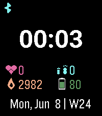
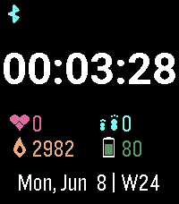
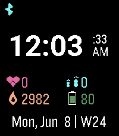
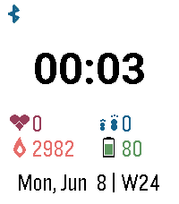
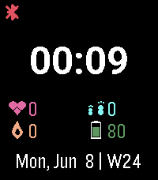
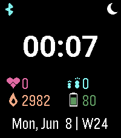

# Clean Overview

A clean digital watchface for Pebble Time 2 (emery, 200×228, 64-color).








**[Install from the Repebble App Store](https://apps.repebble.com/1c84d2017ade47e594a76f20)**

## Features

- **Digital clock** — Roboto Bold 49 font, follows system 12h/24h setting
- **Seconds display** — configurable: Off / Always / On shake (wrist flick)
  - 24h mode: seconds inline in same large font (HH:MM:SS)
  - 12h mode: seconds and AM/PM stacked in smaller font to the right
- **Shake duration** — configurable: 3, 5, 10, or 20 seconds
- **Bluetooth indicator** — top-left corner (cyan = connected, red X = disconnected)
- **Vibrate on BT disconnect** — toggleable
- **Quiet time indicator** — crescent moon icon, top-right corner (visible when active)
- **Health stats** — heart rate, steps, calories, battery
- **Date** — bottom of screen, localized format (German: "So, 7. Jun", English: "Sun, Jun 7")
- **Dark/light mode** — toggleable via settings

## Settings

Open the Pebble app on your phone → find "Clean Overview" → tap the gear icon.

## Building

```bash
pebble build
```

## Installing

```bash
# On emulator
pebble install --emulator emery

# On physical watch (via cloud relay)
pebble install --cloudpebble

# On physical watch (direct, if developer connection works)
pebble install --phone <ip>
```

## TODO

- **Tap-to-show-seconds**: The Pebble SDK's `TouchService` (SDK 4.9+) reports
  `touch_service_is_enabled() = true` on Pebble Time 2, but no touch events are
  actually delivered to watchfaces. The accelerometer's `accel_tap_service` (wrist
  shake) works fine. The screen touch limitation appears to be a system-level
  restriction where watchfaces don't receive touch input — only watchapps do.
  Other watchfaces (e.g. iClock) claim tap support but also don't work on the
  Pebble Time 2 with current firmware. This may be revisited if a firmware update
  enables touch passthrough for watchfaces.
- **Weather display**: Add weather information (temperature, conditions) via
  Open-Meteo API and PebbleKit JS.

## Acknowledgments

Inspired by [fuzzy-text-watchface](https://github.com/asellitt/fuzzy-text-watchface) by asellitt.

## License

Apache-2.0
